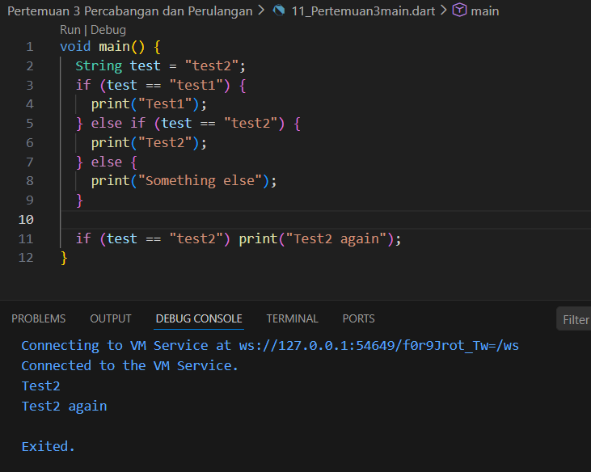
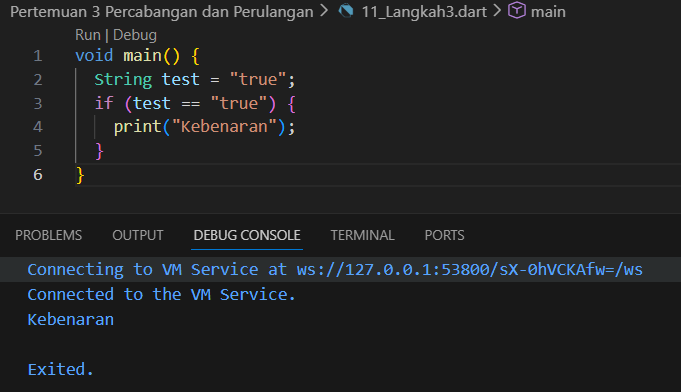
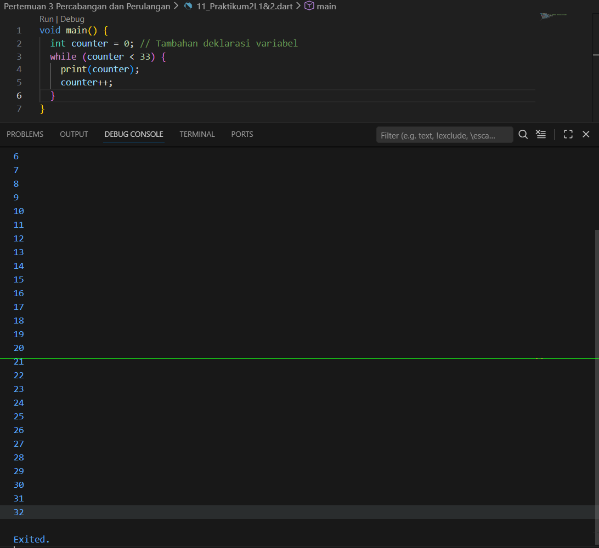
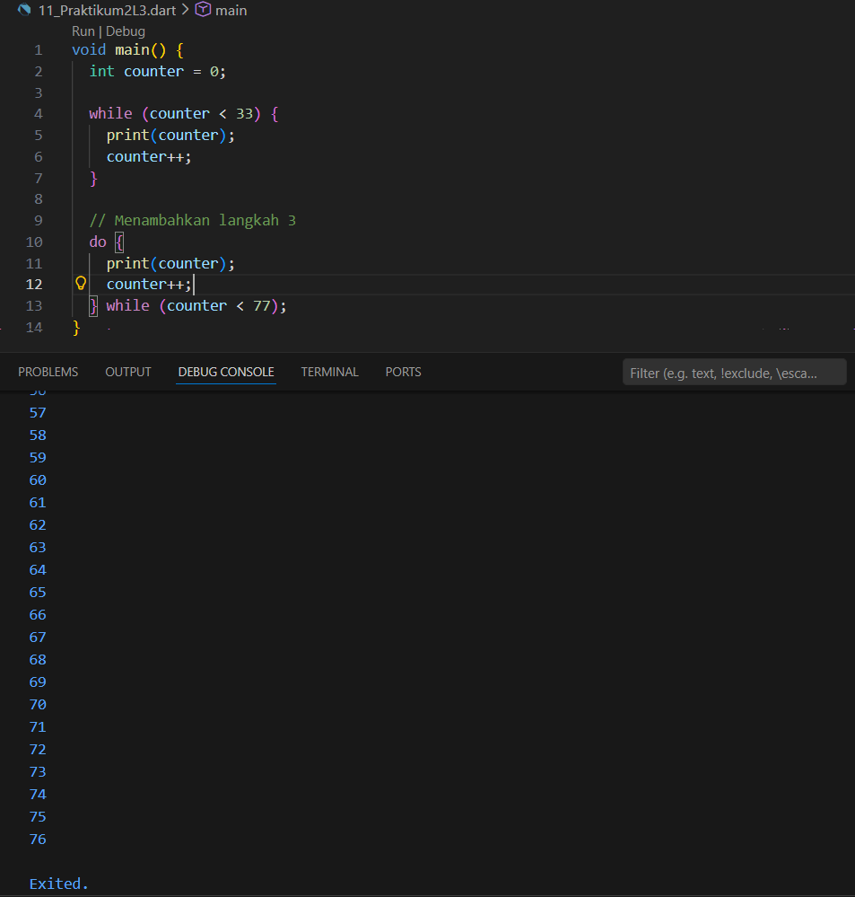
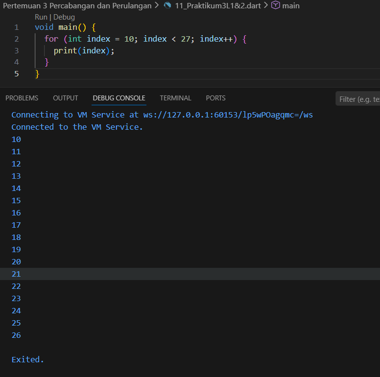
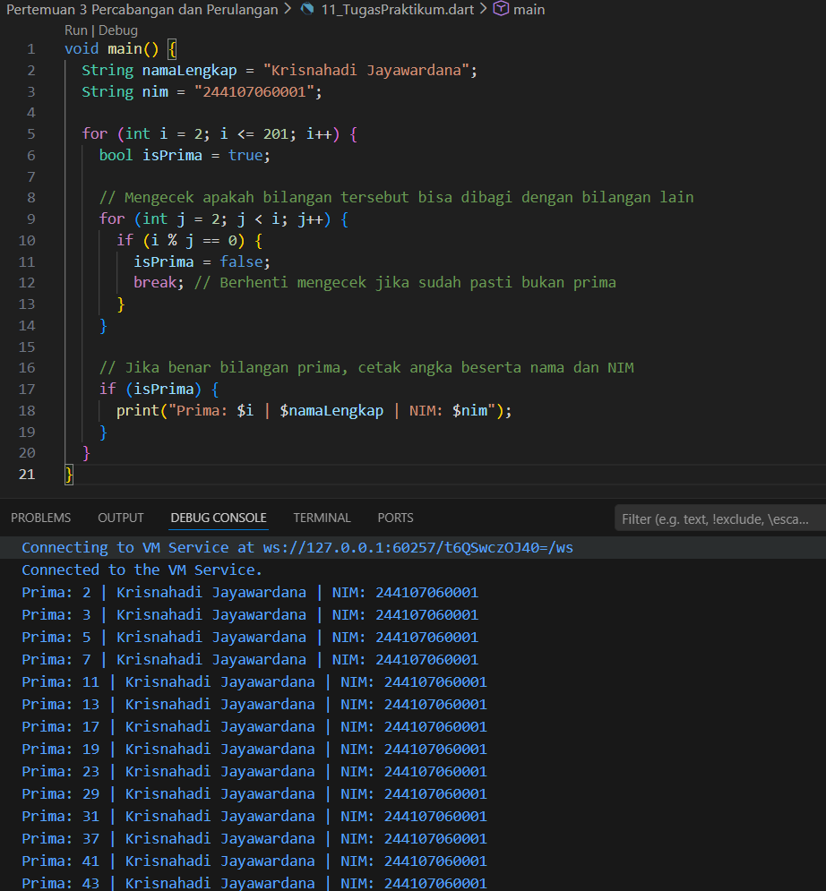

# pemrograman-mobile
## PRAKTIKUM 1
- Langkah 1&2:
Silakan coba eksekusi (Run) kode pada langkah 1 tersebut. Apa yang terjadi? Jelaskan!

Penjelasan:
Ketika kode asli dieksekusi, akan terjadi error karena bahasa Dart bersifat case-sensitiv sehingga penulisan else If dan Else dengan huruf kapital tidak dikenali dan harus diperbaiki menjadi huruf kecil (else if dan else). Setelah penulisan diperbaiki dan dijalankan di VS Code, program akan berhasil mengeksekusi dan menghasilkan output teks "Test2" dan "Test2 again" karena nilai variabel test ("test2") cocok dengan kondisi logika pada blok penyeleksian kedua dan juga pernyataan if baris tunggal di bagian akhir.
- Langkah 3:
Apa yang terjadi ? Jika terjadi error, silakan perbaiki namun tetap menggunakan if/else.

Penjelasan:
Jika kode bawaan pada langkah ini dieksekusi langsung, akan terjadi error berupa tipe data String tidak dapat ditetapkan ke boolean, karena Dart secara ketat mewajibkan parameter di dalam struktur if harus bernilai logika boolean (true atau false), bukan teks (string). Untuk memperbaikinya tanpa mengubah tipe data awal, kita harus mengubah ekspresi penyeleksian di dalam if menjadi operasi perbandingan test == "true" agar menghasilkan nilai boolean, sehingga program dapat mendeteksi bahwa kondisi bernilai benar dan mencetak "Kebenaran" ke terminal.

## PRAKTIKUM 2
- Langkah 1&2
Silakan coba eksekusi (Run) kode pada langkah 1 tersebut. Apa yang terjadi? Jelaskan! Lalu perbaiki jika terjadi error.

Penjelasan:
Kalau kode bawaan di Langkah 1 langsung dijalankan, programnya pasti error karena variabel counter belum dibuat atau dikenali sama sekali. Cara memperbaikinya gampang, cukup tambahkan deklarasi nilai awalnya dulu, misalnya int counter = 0; tepat sebelum perulangan dimulai. Setelah diperbaiki, kode ini bakal menjalankan perulangan while dengan mengecek apakah nilai counter masih di bawah 33, lalu mencetak angkanya ke layar dan terus menambahkannya satu per satu (counter++) sampai akhirnya berhenti persis di angka 32.
- Langkah 3
Apa yang terjadi ? Jika terjadi error, silakan perbaiki namun tetap menggunakan do-while.

Penjelasan:
Waktu kode do-while ini ditambahkan di bawahnya, program bisa langsung jalan lancar tanpa error asalkan kita menggabungkannya dengan variabel counter yang sudah kita buat di langkah sebelumnya. Bedanya dari while biasa, struktur do-while ini bakal maksa program buat ngejalanin perintah cetak dan tambah nilai minimal satu kali di awal, baru ngecek kondisinya di akhir. Karena nilai counter sisa dari perulangan pertama tadi udah di angka 33, program bakal langsung lanjut nyetak angka dari 33 sampai 76, dan baru benar-benar berhenti berulang waktu nilainya menyentuh angka 77.

## PRAKTIKUM 3
- Langkah 1&2
Silakan coba eksekusi (Run) kode pada langkah 1 tersebut. Apa yang terjadi? Jelaskan! Lalu perbaiki jika terjadi error.

Penjelasan:
Kalau kode dari Langkah 1 langsung dijalankan, pasti akan muncul error karena ada beberapa kesalahan penulisan, seperti variabel Index (huruf kapital) yang belum dideklarasikan tipe datanya, perbedaan huruf besar-kecil antara Index dan index (Dart bersifat case-sensitive), dan kurangnya operator penambah pada bagian akhir perulangan. Untuk memperbaikinya, kita harus menambahkan tipe data int, menyamakan semua variabel menjadi huruf kecil index, dan melengkapi increment menjadi index++. Setelah perbaikan tersebut dijalankan di VS Code, program akan berhasil melakukan perulangan dan mencetak angka 10 hingga 26 ke terminal secara berurutan.
- Langkah 3
Apa yang terjadi ? Jika terjadi error, silakan perbaiki namun tetap menggunakan for dan break-continue.

Apa yang terjadi ? Jika terjadi error, silakan perbaiki namun tetap menggunakan for dan break-continue.
Penjelasan:
Sama seperti sebelumnya, penambahan kode di Langkah 3 akan langsung error karena penulisan If dan Else If menggunakan huruf kapital, ditambah variabel Index yang juga besar di awal kata. Setelah kita mengubah semuanya menjadi huruf kecil (if, else if, index), program memang bisa dieksekusi tanpa error, tapi tidak akan ada satu pun angka yang dicetak ke layar terminal. Alasannya karena logika index > 1 akan selalu terpenuhi (karena nilai awalnya 10), sehingga program akan terus-terusan mengeksekusi continue (melewati perintah print) sampai nilainya menyentuh angka 21, di mana perintah break akan langsung menghentikan paksa seluruh perulangan.

## TUGAS PRAKTIKUM
- Buatlah sebuah program yang dapat menampilkan bilangan prima dari angka 0 sampai 201 menggunakan Dart. Ketika bilangan prima ditemukan, maka tampilkan nama lengkap dan NIM Anda.

Penjelasan:
Kode di atas menggunakan perulangan for bersarang untuk mencari bilangan prima dari rentang 0 hingga 201. Perulangan utama (i) dimulai dari angka 2 karena 0 dan 1 secara matematis bukanlah bilangan prima. Di dalamnya, terdapat perulangan kedua (j) yang bertugas mengecek apakah nilai i saat ini bisa dibagi habis oleh angka lain selain 1 dan dirinya sendiri menggunakan operator sisa bagi atau modulus (%). Jika ditemukan angka pembagi yang menghasilkan sisa bagi 0, maka variabel logika isPrima diubah menjadi false dan proses pengecekan dihentikan lewat perintah break. Sebaliknya, jika tidak ada angka yang bisa membaginya, status isPrima tetap true, sehingga program akan mengeksekusi perintah print untuk mencetak bilangan prima tersebut berdampingan dengan nama Krisnahadi Jayawardana dan NIM 244107060001 ke terminal VS Code.